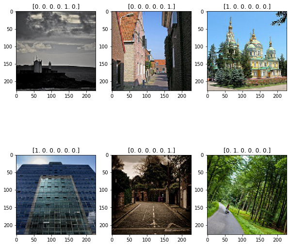
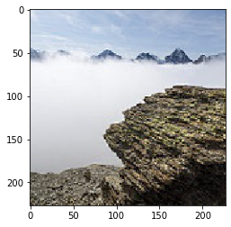
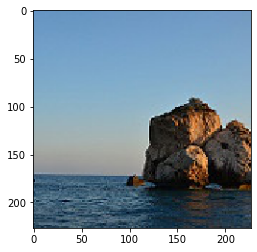
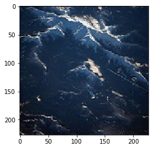
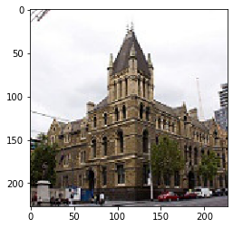
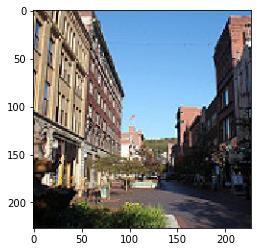
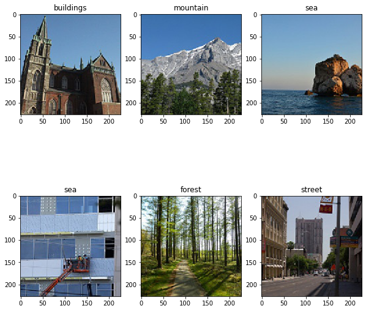

```python
import numpy as np
from keras import layers
from keras.layers import Input, Dense, Activation,BatchNormalization, Flatten, Conv2D, MaxPooling2D
from keras.models import Model
from keras.preprocessing import image
from keras.preprocessing.image import ImageDataGenerator
import keras.backend as K
K.set_image_data_format('channels_last')
import matplotlib.pyplot as plt
from matplotlib.pyplot import imshow
```

    Using TensorFlow backend.
    


```python
path = 'C:\\Users\\tangr\\Desktop\\Image-Classification-using-AlexNet-CNN-Model\\seg_train\\seg_train'
train_datagen = ImageDataGenerator(rescale=1. / 255)
train = train_datagen.flow_from_directory(path, target_size=(227,227), class_mode='categorical')
```

    Found 14034 images belonging to 6 classes.
    


```python
type(train)
```


    keras.preprocessing.image.DirectoryIterator


```python
type(train_datagen)
```


    keras.preprocessing.image.ImageDataGenerator


```python
print("Batch Size for Input Image : ",train[0][0].shape)
print("Batch Size for Output Image : ",train[0][1].shape)
print("Image Size of first image : ",train[0][0][0].shape)
print("Output of first image : ",train[0][1][0].shape)
```

    Batch Size for Input Image :  (32, 227, 227, 3)
    Batch Size for Output Image :  (32, 6)
    Image Size of first image :  (227, 227, 3)
    Output of first image :  (6,)
    


```python
fig , axs = plt.subplots(2,3 ,figsize = (10,10))

axs[0][0].imshow(train[0][0][12])
axs[0][0].set_title(train[0][1][12])

axs[0][1].imshow(train[0][0][10])
axs[0][1].set_title(train[0][1][10])

axs[0][2].imshow(train[0][0][5])
axs[0][2].set_title(train[0][1][5])

axs[1][0].imshow(train[0][0][20])
axs[1][0].set_title(train[0][1][20])

axs[1][1].imshow(train[0][0][25])
axs[1][1].set_title(train[0][1][25])

axs[1][2].imshow(train[0][0][3])
axs[1][2].set_title(train[0][1][3])
```

    F:\AnacondaInstall\envs\zukayu\lib\site-packages\matplotlib\text.py:1165: FutureWarning: elementwise comparison failed; returning scalar instead, but in the future will perform elementwise comparison
      if s != self._text:
    


    Text(0.5, 1.0, '[0. 1. 0. 0. 0. 0.]')





```python

```


```python
def AlexNet(input_shape):
    
    X_input = Input(input_shape)
    
    X = Conv2D(96,(11,11),strides = 4,name="conv0")(X_input)
    X = BatchNormalization(axis = 3 , name = "bn0")(X)
    X = Activation('relu')(X)
    
    X = MaxPooling2D((3,3),strides = 2,name = 'max0')(X)
    
    X = Conv2D(256,(5,5),padding = 'same' , name = 'conv1')(X)
    X = BatchNormalization(axis = 3 ,name='bn1')(X)
    X = Activation('relu')(X)
    
    X = MaxPooling2D((3,3),strides = 2,name = 'max1')(X)
    
    X = Conv2D(384, (3,3) , padding = 'same' , name='conv2')(X)
    X = BatchNormalization(axis = 3, name = 'bn2')(X)
    X = Activation('relu')(X)
    
    X = Conv2D(384, (3,3) , padding = 'same' , name='conv3')(X)
    X = BatchNormalization(axis = 3, name = 'bn3')(X)
    X = Activation('relu')(X)
    
    X = Conv2D(256, (3,3) , padding = 'same' , name='conv4')(X)
    X = BatchNormalization(axis = 3, name = 'bn4')(X)
    X = Activation('relu')(X)
    
    X = MaxPooling2D((3,3),strides = 2,name = 'max2')(X)
    
    X = Flatten()(X)
    
    X = Dense(4096, activation = 'relu', name = "fc0")(X)
    
    X = Dense(4096, activation = 'relu', name = 'fc1')(X) 
    
    X = Dense(6,activation='softmax',name = 'fc2')(X)
    
    model = Model(inputs = X_input, outputs = X, name='AlexNet')

    
    return model
```


```python
alex = AlexNet(train[0][0].shape[1:])
```


```python
alex.summary()
```

    Model: "AlexNet"
    _________________________________________________________________
    Layer (type)                 Output Shape              Param #   
    =================================================================
    input_1 (InputLayer)         (None, 227, 227, 3)       0         
    _________________________________________________________________
    conv0 (Conv2D)               (None, 55, 55, 96)        34944     
    _________________________________________________________________
    bn0 (BatchNormalization)     (None, 55, 55, 96)        384       
    _________________________________________________________________
    activation_1 (Activation)    (None, 55, 55, 96)        0         
    _________________________________________________________________
    max0 (MaxPooling2D)          (None, 27, 27, 96)        0         
    _________________________________________________________________
    conv1 (Conv2D)               (None, 27, 27, 256)       614656    
    _________________________________________________________________
    bn1 (BatchNormalization)     (None, 27, 27, 256)       1024      
    _________________________________________________________________
    activation_2 (Activation)    (None, 27, 27, 256)       0         
    _________________________________________________________________
    max1 (MaxPooling2D)          (None, 13, 13, 256)       0         
    _________________________________________________________________
    conv2 (Conv2D)               (None, 13, 13, 384)       885120    
    _________________________________________________________________
    bn2 (BatchNormalization)     (None, 13, 13, 384)       1536      
    _________________________________________________________________
    activation_3 (Activation)    (None, 13, 13, 384)       0         
    _________________________________________________________________
    conv3 (Conv2D)               (None, 13, 13, 384)       1327488   
    _________________________________________________________________
    bn3 (BatchNormalization)     (None, 13, 13, 384)       1536      
    _________________________________________________________________
    activation_4 (Activation)    (None, 13, 13, 384)       0         
    _________________________________________________________________
    conv4 (Conv2D)               (None, 13, 13, 256)       884992    
    _________________________________________________________________
    bn4 (BatchNormalization)     (None, 13, 13, 256)       1024      
    _________________________________________________________________
    activation_5 (Activation)    (None, 13, 13, 256)       0         
    _________________________________________________________________
    max2 (MaxPooling2D)          (None, 6, 6, 256)         0         
    _________________________________________________________________
    flatten_1 (Flatten)          (None, 9216)              0         
    _________________________________________________________________
    fc0 (Dense)                  (None, 4096)              37752832  
    _________________________________________________________________
    fc1 (Dense)                  (None, 4096)              16781312  
    _________________________________________________________________
    fc2 (Dense)                  (None, 6)                 24582     
    =================================================================
    Total params: 58,311,430
    Trainable params: 58,308,678
    Non-trainable params: 2,752
    _________________________________________________________________
    


```python
alex.compile(optimizer = 'adam' , loss = 'categorical_crossentropy' , metrics=['accuracy'])
```


```python
alex.fit_generator(train,epochs=50)
```

    Epoch 1/50
    439/439 [==============================] - 97s 221ms/step - loss: 2.2360 - accuracy: 0.5202
    Epoch 2/50
    439/439 [==============================] - 96s 218ms/step - loss: 0.9161 - accuracy: 0.6435
    Epoch 3/50
    439/439 [==============================] - 95s 218ms/step - loss: 0.7678 - accuracy: 0.7178
    Epoch 4/50
    439/439 [==============================] - 95s 217ms/step - loss: 0.6490 - accuracy: 0.7708
    Epoch 5/50
    439/439 [==============================] - 95s 217ms/step - loss: 0.6001 - accuracy: 0.7870
    Epoch 6/50
    439/439 [==============================] - 95s 217ms/step - loss: 0.5580 - accuracy: 0.8006
    Epoch 7/50
    439/439 [==============================] - 95s 217ms/step - loss: 0.5219 - accuracy: 0.8166
    Epoch 8/50
    439/439 [==============================] - 95s 217ms/step - loss: 0.4942 - accuracy: 0.8268
    Epoch 9/50
    439/439 [==============================] - 95s 217ms/step - loss: 0.4805 - accuracy: 0.8336
    Epoch 10/50
    439/439 [==============================] - 96s 218ms/step - loss: 0.4495 - accuracy: 0.8386
    Epoch 11/50
    439/439 [==============================] - 96s 218ms/step - loss: 0.4137 - accuracy: 0.8566
    Epoch 12/50
    439/439 [==============================] - 96s 219ms/step - loss: 0.3925 - accuracy: 0.8628
    Epoch 13/50
    439/439 [==============================] - 96s 218ms/step - loss: 0.3775 - accuracy: 0.8689
    Epoch 14/50
    439/439 [==============================] - 96s 218ms/step - loss: 0.3651 - accuracy: 0.8727
    Epoch 15/50
    439/439 [==============================] - 96s 219ms/step - loss: 0.3513 - accuracy: 0.8782
    Epoch 16/50
    439/439 [==============================] - 96s 218ms/step - loss: 0.3318 - accuracy: 0.8841
    Epoch 17/50
    439/439 [==============================] - 95s 217ms/step - loss: 0.3175 - accuracy: 0.8895
    Epoch 18/50
    439/439 [==============================] - 97s 220ms/step - loss: 0.3105 - accuracy: 0.8879
    Epoch 19/50
    439/439 [==============================] - 96s 219ms/step - loss: 0.2782 - accuracy: 0.9029
    Epoch 20/50
    439/439 [==============================] - 96s 218ms/step - loss: 0.2797 - accuracy: 0.9016
    Epoch 21/50
    439/439 [==============================] - 95s 217ms/step - loss: 0.2568 - accuracy: 0.9114
    Epoch 22/50
    439/439 [==============================] - 95s 217ms/step - loss: 0.2461 - accuracy: 0.9129
    Epoch 23/50
    439/439 [==============================] - 97s 221ms/step - loss: 0.2271 - accuracy: 0.9173
    Epoch 24/50
    439/439 [==============================] - 96s 219ms/step - loss: 0.2117 - accuracy: 0.9240
    Epoch 25/50
    439/439 [==============================] - 97s 220ms/step - loss: 0.2005 - accuracy: 0.9301
    Epoch 26/50
    439/439 [==============================] - 97s 220ms/step - loss: 0.1964 - accuracy: 0.9312
    Epoch 27/50
    439/439 [==============================] - 97s 220ms/step - loss: 0.1803 - accuracy: 0.9363
    Epoch 28/50
    439/439 [==============================] - 96s 220ms/step - loss: 0.1687 - accuracy: 0.9411
    Epoch 29/50
    439/439 [==============================] - 96s 218ms/step - loss: 0.1502 - accuracy: 0.9473
    Epoch 30/50
    439/439 [==============================] - 95s 217ms/step - loss: 0.1514 - accuracy: 0.9481
    Epoch 31/50
    439/439 [==============================] - 95s 217ms/step - loss: 0.1424 - accuracy: 0.9522
    Epoch 32/50
    439/439 [==============================] - 95s 217ms/step - loss: 0.1203 - accuracy: 0.9585
    Epoch 33/50
    439/439 [==============================] - 95s 216ms/step - loss: 0.1143 - accuracy: 0.9610
    Epoch 34/50
    439/439 [==============================] - 95s 216ms/step - loss: 0.1077 - accuracy: 0.9649
    Epoch 35/50
    439/439 [==============================] - 95s 216ms/step - loss: 0.1085 - accuracy: 0.9654
    Epoch 36/50
    439/439 [==============================] - 95s 216ms/step - loss: 0.1114 - accuracy: 0.9624
    Epoch 37/50
    439/439 [==============================] - 95s 216ms/step - loss: 0.0822 - accuracy: 0.9720
    Epoch 38/50
    439/439 [==============================] - 96s 218ms/step - loss: 0.0932 - accuracy: 0.9686
    Epoch 39/50
    439/439 [==============================] - 96s 218ms/step - loss: 0.0869 - accuracy: 0.9726
    Epoch 40/50
    439/439 [==============================] - 95s 217ms/step - loss: 0.0793 - accuracy: 0.9745
    Epoch 41/50
    439/439 [==============================] - 96s 218ms/step - loss: 0.0832 - accuracy: 0.9739
    Epoch 42/50
    439/439 [==============================] - 95s 218ms/step - loss: 0.0666 - accuracy: 0.9784
    Epoch 43/50
    439/439 [==============================] - 96s 218ms/step - loss: 0.0753 - accuracy: 0.9761
    Epoch 44/50
    439/439 [==============================] - 96s 218ms/step - loss: 0.0761 - accuracy: 0.9762
    Epoch 45/50
    439/439 [==============================] - 96s 218ms/step - loss: 0.0651 - accuracy: 0.9791
    Epoch 46/50
    439/439 [==============================] - 96s 218ms/step - loss: 0.0585 - accuracy: 0.9799
    Epoch 47/50
    439/439 [==============================] - 96s 218ms/step - loss: 0.0593 - accuracy: 0.9818
    Epoch 48/50
    439/439 [==============================] - 96s 219ms/step - loss: 0.0550 - accuracy: 0.9825
    Epoch 49/50
    439/439 [==============================] - 96s 219ms/step - loss: 0.0701 - accuracy: 0.9783
    Epoch 50/50
    439/439 [==============================] - 96s 219ms/step - loss: 0.0550 - accuracy: 0.9833
    


    <keras.callbacks.callbacks.History at 0x1d576b68748>


```python
path_test = 'C:\\Users\\tangr\\Desktop\\Image-Classification-using-AlexNet-CNN-Model\\seg_test\\seg_test'
test_datagen = ImageDataGenerator(rescale=1. / 255)
test = test_datagen.flow_from_directory(path_test, target_size=(227,227), class_mode='categorical')
```

    Found 3000 images belonging to 6 classes.
    


```python
preds = alex.evaluate_generator(test)

print ("Loss = " + str(preds[0]))
print ("Test Accuracy = " + str(preds[1]))
```

    Loss = 0.1878412961959839
    Test Accuracy = 0.871999979019165
    


```python
path_test = 'C:\\Users\\tangr\\Desktop\\Image-Classification-using-AlexNet-CNN-Model\\seg_pred\\'
predict_datagen = ImageDataGenerator(rescale=1. / 255)
predict = predict_datagen.flow_from_directory(path_test, target_size=(227,227), batch_size = 1,class_mode='categorical')
```

    Found 7301 images belonging to 1 classes.
    


```python
predictions = alex.predict_generator(predict)
```


```python
len(predictions)
```


    7301


```python

```


```python
imshow(predict[5300][0][0])
plt.imsave("predicted1.png",predict[5300][0][0])
```





```python
print(predictions[5300])
```

    [2.6537746e-04 6.4374256e-04 4.5224793e-02 1.2667084e-01 8.2719183e-01
     3.3225565e-06]
    


```python
imshow(predict[1300][0][0])
```


    <matplotlib.image.AxesImage at 0x1d5f8922ec8>





```python
predictions[1300]
```


    array([5.2910016e-12, 1.1768315e-13, 1.3519180e-09, 1.0530314e-09,
           1.0000000e+00, 2.9473104e-14], dtype=float32)


```python
imshow(predict[4400][0][0])
```


    <matplotlib.image.AxesImage at 0x1d5f86072c8>





```python
predictions[4400]
```


    array([1.4107786e-04, 7.2401655e-03, 9.0441413e-02, 5.1603377e-01,
           3.8608500e-01, 5.8551897e-05], dtype=float32)


```python
imshow(predict[700][0][0])
plt.imsave("predicted2.png" , predict[700][0][0])
```





```python
print(predictions[700])
```

    [9.9999893e-01 1.2553875e-08 7.1486659e-07 4.0256100e-07 1.3809868e-08
     8.5458379e-10]
    


```python
imshow(predict[6500][0][0])
```


    <matplotlib.image.AxesImage at 0x1d5f89e5c88>





```python
predictions[6500]
```


    array([1.1534187e-01, 1.1149397e-06, 3.4518308e-07, 7.2168582e-08,
           2.6449530e-07, 8.8465625e-01], dtype=float32)


```python

```


```python
import os 
def get_category(predicted_output):
    path  = "C:\\Users\\tangr\\Desktop\\Image-Classification-using-AlexNet-CNN-Model\\seg_train\\seg_train"
    return os.listdir(path)[np.argmax(predicted_output)] 
```


```python
print(get_category(predictions[700]))
```

    buildings
    


```python
fig , axs = plt.subplots(2,3 ,figsize = (10,10))

axs[0][0].imshow(predict[1002][0][0])
axs[0][0].set_title(get_category(predictions[1002]))

axs[0][1].imshow(predict[22][0][0])
axs[0][1].set_title(get_category(predictions[22]))

axs[0][2].imshow(predict[1300][0][0])
axs[0][2].set_title(get_category(predictions[1300]))

axs[1][0].imshow(predict[3300][0][0])
axs[1][0].set_title(get_category(predictions[3300]))

axs[1][1].imshow(predict[7002][0][0])
axs[1][1].set_title(get_category(predictions[7002]))

axs[1][2].imshow(predict[512][0][0])
axs[1][2].set_title(get_category(predictions[512]))
```


    Text(0.5, 1.0, 'street')





```python

```
